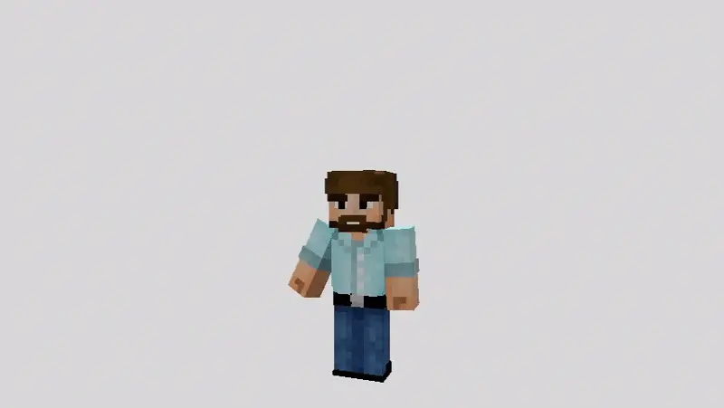
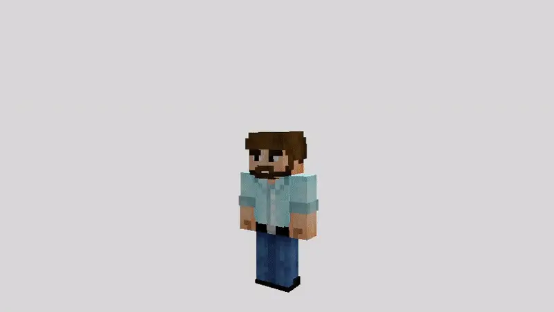

# Эмоции

Мод **EmoteCraft** добавляет анимированные эмоции.

Вы можете зайти на сервер с ванильного клиента, но чтобы использовать эмоции и видеть эмоции других игроков — необходимо установить мод для **Fabric** или **Forge**:  
<CustomLinkComponent href="https://modrinth.com/mod/emotecraft" title="Скачать EmoteCraft" />

## Как пользоваться

1. Нажмите клавишу `B` (английская раскладка) — откроется меню с эмоциями.  
2. Кликните по кнопке в правом нижнем углу `Все эмоции`, затем по 'Настройка эмоций`.  
3. Выберите эмоцию, затем нажмите на место в круге, куда хотите её установить.  
4. Нажмите `Готово`, снова откройте меню (`B`) и протестируйте эмоции.  
5. Чтобы добавить больше эмоций — скачайте их и поместите в папку `.minecraft/emotes`.  
<CustomLinkComponent href="https://docs.google.com/document/d/1mIh0roUFZ3xiROibgymcMNu6nrD6hrXF18rTmp0SkB4/edit" title="Скачать больше эмоций" />

<CustomLinkComponent href="https://kosmx.gitbook.io/emotecraft/tutorial/custom-emotes" title="Гайд по созданию эмоций в Blender или Blockbench" />
